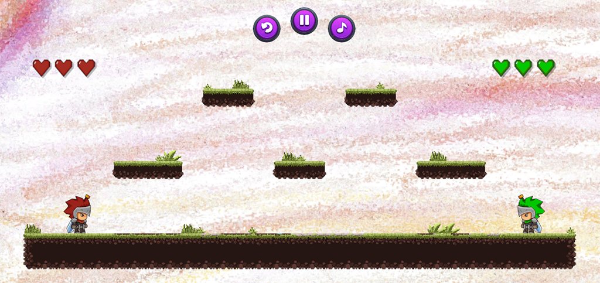
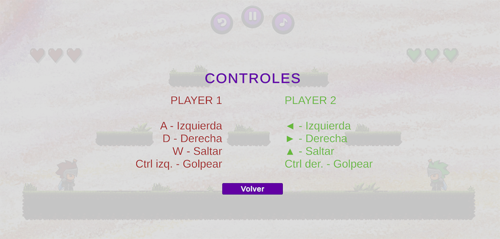
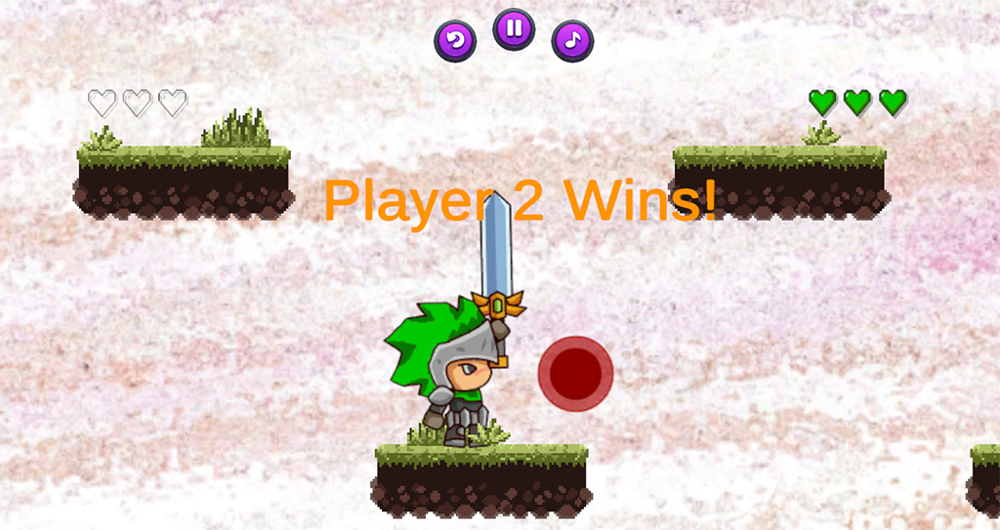

```bash
 /´\\	 ____  ____  _  _       __ _   __   _  _  _  _  ____  __     __   ____  ____ 
((--))	(    \(  __)/ )( \ ___ (  ( \ / _\ / )( \/ )( \(  __)(  )   / _\ (    \(  __)
 \\´/	 ) D ( ) _) \ \/ /(___)/    //    \) __ () \/ ( ) _) / (_/\/    \ ) D ( ) _) 
 /´\\	(____/(____) \__/      \_)__)\_/\_/\_)(_/\____/(____)\____/\_/\_/(____/(____)
((--))       :: Desarrollos-NahuelAde ::                       (v1.0.0 RELEASE)
 \\´/
```

# Juego de Combate 2D con Unity - Power of Masters: Death Match 5

Este proyecto es un juego 2D estilo combate multijugador creado con Unity, que integra físicas, animaciones, control de personajes, HUD y audio dinámico. Pensado como un entorno de formación, cubre múltiples aspectos fundamentales del desarrollo de videojuegos.

---

## Características

- Combate local entre dos jugadores.
- Controladores de animaciones individuales mediante Animator Override Controller.
- Detección de colisiones física con Rigidbody 2D y Colliders.
- Movimiento fluido, saltos y ataques.
- Sistema de vidas y condiciones de victoria/derrota.
- Raycast para detectar suelo antes de permitir salto.
- Sistema de pausa y menú con navegación UI.
- Sonido ambiental y efectos sonoros contextuales con Audio Mixer.
- Cámara dinámica con Cinemachine.

---

## Arquitectura del proyecto

- `GameManager`: lógica central del juego, incluyendo victoria, derrota y gestión de UI.
- `PlayerController`: controla el movimiento, físicas y ataques del jugador.
- `HUDManager`: actualiza visualmente las vidas y controla la UI del jugador.
- `PauseMenuManager`: controla el menú de pausa, reinicio y sonido.
- `AudioController`: gestiona la reproducción de efectos y música ambiente.
- `VictoryScreen`: UI para mostrar el resultado final.

---

## Estructura del proyecto

```bash
Assets/
 ├── Animations/              # Controladores de animación y animaciones de personajes
 ├── Audio/                   # Clips de sonido y Audio Mixers
 ├── Prefabs/                 # Prefabricados de jugadores y HUD
 ├── Scenes/
 │   └── MainScene.unity      # Escena principal del juego
 ├── Scripts/
 │   ├── GameManager.cs
 │   ├── PlayerController.cs
 │   ├── HUDManager.cs
 │   ├── PauseMenuManager.cs
 │   └── AudioController.cs
 ├── Sprites/                 # Imágenes de personajes, fondo y elementos visuales
 ├── UI/                      # Canvases, botones y elementos de interfaz
 └── Materials/               # Materiales gráficos
README.md
```

---

## Requisitos

- **Unity Editor 2022.3 o superior** (LTS recomendado)
- **Paquetes**: Cinemachine (v2.8+)
- **Plataforma objetivo**: Windows
- **Controladores**: teclado local para dos jugadores
- **Sistema operativo**: Windows 10+

---

## Instalación y Uso

1. Clona este repositorio:
```bash
git clone https://github.com/NahuelAde/power_of_masters-death_match-5.git
```
2. Abre el proyecto en Unity.
3. Asegúrate de tener el paquete Cinemachine instalado desde Package Manager.
4. Carga la escena MainScene.unity.
5. Presiona Play en el editor o compila el proyecto para Windows.

---

## Vista previa

- Inicio del juego


- Menú de controles


- Derrota


---

## Prueba rápida (.exe incluido)

Este repositorio contiene un archivo ejecutable para Windows que te permite probar el juego sin necesidad de abrir Unity.

***¿Cómo usarlo?***

1. Dirígete a la carpeta PowerOfMasters-DeathMatch5/.
2. Ejecuta el archivo Power of Masters - Death Match 5.exe.
3. ¡Disfruta del combate local!

⚠️ Asegúrate de tener permisos de ejecución en tu sistema y que el archivo no haya sido bloqueado por el sistema operativo. En caso de advertencias, haz clic derecho → Propiedades → "Desbloquear".

---

## Características pendientes

- Animaciones de muerte personalizadas por jugador.
- Partículas al golpear y recibir daño.
- IA básica para combate contra CPU.

---

## Créditos

- Sprites del caballero obtenidos de [Knight Sprite Sheet FREE – Unity Asset Store](https://assetstore.unity.com/packages/2d/characters/knight-sprite-sheet-free-93897)
- Tilemap [Pixel Art Woods Tileset and Background](https://assetstore.unity.com/packages/2d/environments/pixel-art-woods-tileset-and-background-280066)

---

## Licencia

Este proyecto está disponible para uso libre, educativo o personal. Cualquier redistribución o modificación debe mencionar al autor original: **Nahuel Ade**.

© Desarrollado por [Nahuel Ade](https://github.com/NahuelAde)
